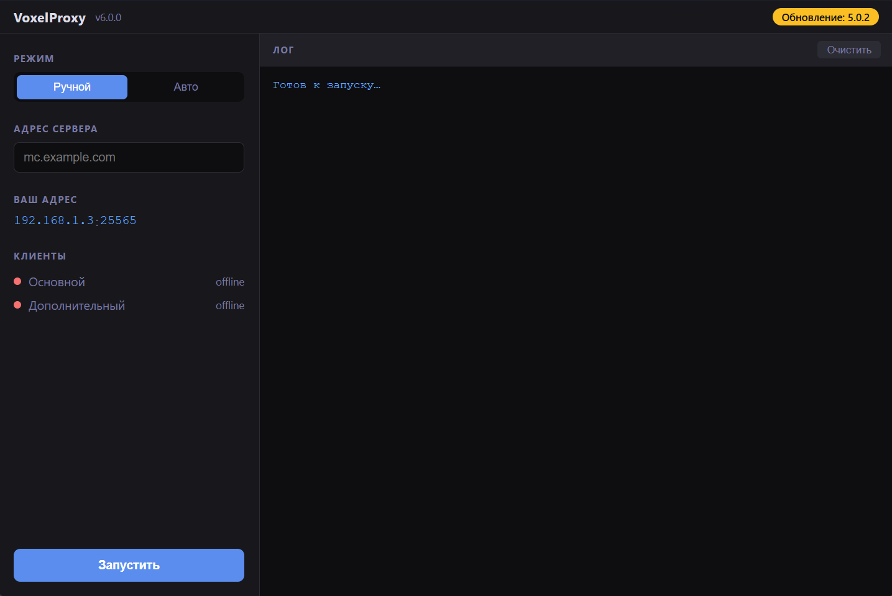

# VoxelProxy

Бесплатный аналог [takker.ru](https://takker.ru) — прокси-сервер для Minecraft с графическим интерфейсом, позволяющий двум клиентам одновременно играть на одном сервере под одним ником.

---

## Как это работает

VoxelProxy запускается локально и слушает порт `25565`. Оба клиента подключаются к нему, а он уже подключается к реальному серверу. Первый подключившийся клиент становится **активным** (его ввод отправляется на сервер). Второй — **пассивным** (получает все пакеты от сервера, но его ввод игнорируется).

```
[Основной клиент] ──► [ViaProxy] ───┐
                      (опционально) ├──► [VoxelProxy] ──► [Minecraft-сервер]
[Доп. клиент] ────────────────────┘
```

- Пакеты от **активного клиента** → сервер
- Пакеты от **сервера** → оба клиента
- Позиция игрока синхронизируется между клиентами
- Транзакции инвентаря отслеживаются и синхронизируются
- При отключении активного клиента управление автоматически переходит ко второму

---

## Интерфейс

VoxelProxy имеет графический интерфейс на базе **Tauri v2**. Окно разделено на две панели:

- **Левая панель** — конфигурация: выбор режима, адрес сервера, локальный IP, статус клиентов, кнопки запуска/остановки
- **Правая панель** — лог событий прокси в реальном времени

Индикаторы **Основной** / **Дополнительный** загораются зелёным по мере подключения клиентов и гаснут при их отключении.



## Использование

Запустите `voxelproxy.exe` и выберите нужный режим вкладкой **Ручной** или **Авто**.

---

### Ручной режим

1. Откройте вкладку **Ручной**
2. Введите адрес сервера (поддерживаются домен, IP, SRV-записи)
3. Нажмите **Запустить** — в логе появится локальный IP для подключения
4. **Сначала** подключите основной клиент — он станет активным
5. **Затем** подключите дополнительный клиент

---

### Автоматический режим (Windows, хотспот)

Режим для сценария, когда дополнительный клиент подключён через Wi-Fi хотспот с этого же ПК. WinDivert перехватывает трафик на уровне ядра и прозрачно перенаправляет его в прокси — адрес вводить не нужно, он берётся из самого Handshake пакета.

**Требования:**

- Запуск от имени администратора (необходим для WinDivert)
- Файлы `WinDivert.dll` и `WinDivert64.sys` рядом с `voxelproxy.exe` (входят в архив релиза)
- Windows-хотспот активен (192.168.137.x)

**Порядок подключения:**

1. Запустите `voxelproxy.exe` от администратора и откройте вкладку **Авто**
2. Нажмите **Запустить**
3. **Сначала** подключите дополнительный клиент к серверу как обычно через хотспот (например `mc.funtime.su`)
4. **Затем** подключите основной клиент к тому же серверу напрямую (`127.0.0.1:25565`)
5. VoxelProxy автоматически спарит их и установит соединение

Трафик с портов **25560–25570** перехватывается WinDivert.

#### Устранение проблем

**Клиент не подключается / нет интернета на клиенте**

WinDivert или служба хотспота могли зависнуть. Перезапустите в PowerShell от администратора:

```powershell
sc.exe stop windivert
Stop-Service SharedAccess
```

Затем снова включите хотспот в настройках Windows и перезапустите `voxelproxy.exe`.

**Не работает при включённом VPN (TUN-режим)**

VPN в TUN-режиме создаёт виртуальный сетевой адаптер, который перехватывает весь IP-трафик раньше WinDivert. В результате пакеты от клиента не попадают на форвард-слой, и перенаправление не работает. **Отключите VPN** на хосте перед использованием автоматического режима.

---

## Возможности

- **Графический интерфейс** — окно на базе Tauri v2 с логом, статусом клиентов и кнопками управления сессией
- **Два режима** — ручной (вводите адрес сервера) и автоматический (WinDivert, прозрачный перехват через хотспот)
- **Автопереключение** — если активный клиент отключается, управление переходит ко второму без разрыва соединения с сервером
- **Синхронизация позиции** — дополнительному клиенту отправляются корректирующие пакеты позиции, чтобы его состояние не расходилось с активным
- **Синхронизация транзакций** — транзакции инвентаря отслеживаются для обоих клиентов и корректно воспроизводятся при переключении
- **Проверка обновлений** — при запуске автоматически проверяется наличие новой версии на GitHub; при обнаружении появляется кнопка с ссылкой на скачивание
- **DNS-резолвер** — поддерживает SRV-записи (`_minecraft._tcp`), A/AAAA-записи и прямые IP-адреса

---

## Поддерживаемые версии

| Версия Minecraft | Поддержка                                                   |
| ---------------- | ----------------------------------------------------------- |
| 1.16.5           | ✅ Полная                                                   |
| 1.20.1           | ✅ Полная                                                   |
| 1.21.4           | ✅ Полная                                                   |
| Другие версии    | ❌ Через [ViaProxy](https://github.com/ViaVersion/ViaProxy) |

---

## Ограничения

- **Лицензионные (online-mode) серверы не поддерживаются** — используйте ViaProxy как промежуточный слой
- Ввод от дополнительного клиента игнорируется, пока подключён основной
- Оба клиента должны быть одной версии
- Автоматический режим — только Windows (требует прав администратора)

---

## Советы

- Для лучшей стабильности запускайте прокси на отдельном ПК
- Можно безопасно закрыть один из клиентов — второй продолжит играть
- Если сервер требует лицензию, подключитесь через ViaProxy с настроенным аккаунтом

---

## Перенаправление трафика (Linux, iptables)

> Только для Linux. Требуются права root/sudo и наличие `iptables`.

Скрипт `iptables-route.sh` перенаправляет весь TCP-трафик на портах **25560–25570** на указанный адрес (VoxelProxy) на уровне ядра Linux через `iptables DNAT OUTPUT`.

**Сценарий использования:** клиент подключается к любому адресу на порту из диапазона 25560–25570, ядро прозрачно перенаправляет соединение на VoxelProxy (`IP:PORT`), который уже проксирует на реальный сервер.

### Использование

**Сделать скрипт исполняемым (один раз):**

```bash
chmod +x iptables-route.sh
```

**Запустить интерактивное меню:**

```bash
sudo ./iptables-route.sh
```

Меню предлагает:

```
VoxelProxy Lite (Порты: 25560:25570)
1) Включить (Задать выход)
2) Выключить
3) Удалить логи (историю)
4) Выход
```

- **Включить** — запрашивает адрес назначения в формате `IP:PORT` и активирует перенаправление
- **Выключить** — удаляет правило iptables
- **Удалить логи** — очищает упоминания скрипта из `~/.bash_history` и `~/.zsh_history`

> **Важно:** правила iptables сбрасываются при перезагрузке. Для автовосстановления используйте `iptables-persistent`
> или добавьте вызов скрипта в `@reboot cron`.

---

**Лицензия:** [GPL-3.0](LICENSE)
